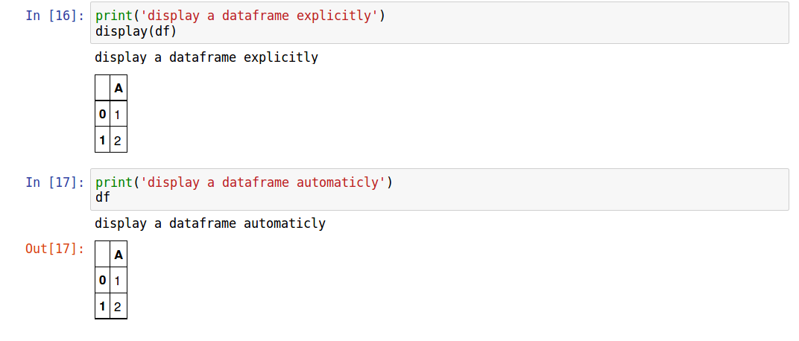

# Version 0.11

# Project Goal
This project provides a initial pelican configs and theme files to offer a painless experience to publish jupyter notebooks as pelican blogs into gitpages.

Although pelican has ipynb plugin to convert .ipynb file into blog html, many adaptations have to be made to support jupyter notebook bloggin.

primary adaptations

* .ipynb files seldomly exist alone, they usually work with related static files such as test data, images, etc. They are better organized in  indivisual directorys. Pelicanconf.py is configured so that pelican can detect .ipynb files in directorys and the links are not broken after they are converted into html
* In .ipynb generated html, contents are nested deeply in <div> elements so some javascript plugins such as tocify.js cannot work properly. So scripts are added in article template to properly extract content from the nested <div> block
* 'Clean-blog' theme in pelican provides a clean, good looking but provide too little useful component common to blogs, such as
    * Duoshuo Comments (disqus is blocked for chinese users)
    * Responsive sidebar toc menu
    * Menus for category, tag, archives
    * Wechat award image

# Demonstration
My jupyter notebooks are kept in [here](https://github.com/junjiecai/jupyter_labs/tree/master/exolution)　and you can check what they look like after they are published into blogs [here](https://junjiecai.github.io)

# Perquisites
If you have no idea about pelican and gitpages, please read one of these articles first.

* [Building a data science portfolio: Making a data science blog](https://www.dataquest.io/blog/how-to-setup-a-data-science-blog/)
* [my blog on the same topic (Chinese)](http://junjiecai.github.io/posts/2016/Aug/10/blog_with_jupyter/)

# How to use this project
After cloning the repo to your local machine, finish the following tasks

## create virtualenv (Recommended)
Install virtualenv if you don't have it
```
pip install virtualenv
```
Change directory into the project folder and create a virutalenv for it, python3.5 or higher is recommended

```
virtualenv -p /usr/bin/python3.5 venv
```

Activate the virtualenv

```
source venv/bin/activate
```

## install requirements
create a requirements.txt and put in the following lines
```
markdown
pelican
jupyter
ipython
nbconvert
beautifulsoup4
matplotlib
```

Then run

```
pip install -r requirements.txt
```

## Register DUOSHUO 
Register a DUOSHUO service [here](http://duoshuo.com/) for your blog and take note on your DUOSHUO site name. (looks like 'XXXX.duoshuo.com')

## Register Google Analytics
Register a google analytics service [here](https://analytics.google.com/) for your blog site and take note on the google analytics id (looks like 'UA-xxxxxxxx-x')

## Create a customs.py
create a customs.py file (same folder with pelicanconf.py) and add the following content
```
AUTHOR = 'YourName'
SITENAME = "YourSiteName"
DUOSHUO_PREFIX = "YourSiteUrl"
DUOSHUO_SITENAME = "your duoshuo site name" #If your site name is 'XXXX.duoshuo.com', just fill in XXXX here
GITHUB_URL = <your github url>
GOOGLE_ANALYTICS = 'UA-xxxxxxxx-x' #Your google analytics id
ARTICLE_PATHS = ['articles'] # your article paths, relative to PATH in pelicanconf.py. See examples below
JUPYTER_BASE = 'base url' # your base url to folder containing related .ipynb file and other resources. See explaination below
```

### ARTICLE_PATHS
For example, here we have files structured like this

```
content
|   articles
    |   jupyter_labs
        |   labs_A
            |   article_0
                |   article0.ipynb
                |   article0.ipynb-meta
            |   article_1
                |   article1.ipynb
                |   article1.ipynb-meta
        |   labs_B

    |   lifes
        |   article_2
            |   article2.ipynb
            |   article2.ipynb-meta
|   pages
```

### JUPYTER_BASE
If folders of .ipynb files and related files are pushed into an github repository, JUPYTER_BASE can be used to create a paragraph providing links to the original .ipynb file for each blog article. This automatically generated paragraph is inserted at the beginning of each blog after publishing.

For example, I have files structured like this

```
content
|   articles
    |   jupyter_labs
        |   exolution
            |   0000_blog_with_jupyter # folder name containing .ipynb file
                |   0000_blog_with_jupyter.ipynb
                |   0000_blog_with_jupyter.ipynb-meta
|   pages
```

After I push jupyter_labs directory into my repository (https://github.com/junjiecai/jupyter_labs), the url pointing to 0000_blog_with_jupyter.ipynb is 

https://github.com/junjiecai/jupyter_labs/tree/master/exolution/0000_blog_with_jupyter

This url can be seperated into two parts

* 'https://github.com/junjiecai/jupyter_labs/tree/master/exolution/', which is invariant between articles. This is the value of JUPYTER_BASE
* 0000_blog_with_jupyter, folder name containing the .ipynb file and related resources. This is automatically extracted and appended into JUPYTER_BASE


And we only want to publish contents in directory labs_A and lifes to blog posts, then set ARTICLE_PATHS as
```
ARTICLE_PATHS = ['articles/jupyter_labs/labs_A','articles/lifes']
```

## Replace images
Images are stored under "/themes/pelican-clean-blog/static/images"

* home-bg.jpg: Used for blog background
* award.jpeg: Used for wechat payment qr code image at the bottom of each article. I appreciate it very much if you keep my payment qr code:)

## Create content folder
Create a folder named with 'content' in the project folder

## Edit aboutme page
Edit content in content/pages/aboutme.ipynb

## Compose your jupyter notebook
1. Create a folder (it must be subdirectory of paths defined in ARTICLE_PATHS), you can create one folder for each jupyter notebook lab.
2. Create a .ipynb file and write down the content you wish
3. Create a .ipynb-meta file to provide meta-data about your blog, such as id, title, description .etc, the .ipynb-meta file must has same filename with the .ipynb file


For example: 
If I want write down a jupyter notebook about pytest, and I set ARTICLE_PATHS like this
```
ARTICLE_PATHS = ['articles']
```

Then I should end up with the following folders and files

```
content
|   articles
    |   pytest_intro
        |   pytest_intro.ipynb
        |   pytest_intro.ipynb-meta

```

Within the pytest_intro.ipynb-meta, it should looks like this.
```
Title: Pytest Introduction
Slug: pytest_intro
Date: 2016-08-15 21:05
Modified: 2016-08-15 21:05
Tags: python, testing
Category:jupyter_labs
Author: Exolution
Id:0001
Summary: Introduction for pytest
```

'Id' is a number assigned to each blog and should be kept unqiue among all blogs, or comments system like DUOSHUO won't work properly.

## Add your gitpages remote
```
git remote add blog git@github.com:[username]/[username].github.io.git
```
Replace [username] with your github username

## Generate html and push to gitpages
Run these three commands and enjoy your blogs.
```
pelican
ghp-import output -b master
git push blog master
```

*** Don't forget to delete .ipynb_checkpoints files before run ```pelican``` command***

## Tips for blogging
In jupyter notebook, ```print``` and ```IPython.display.display``` won't create ```Output[x]``` mark in the output region, but auto-displaying for the last object in input region does.



Mixting these two style makes the generated HTML harder to read, so always explicitly call print or display to make the output region consistent is recommended.


